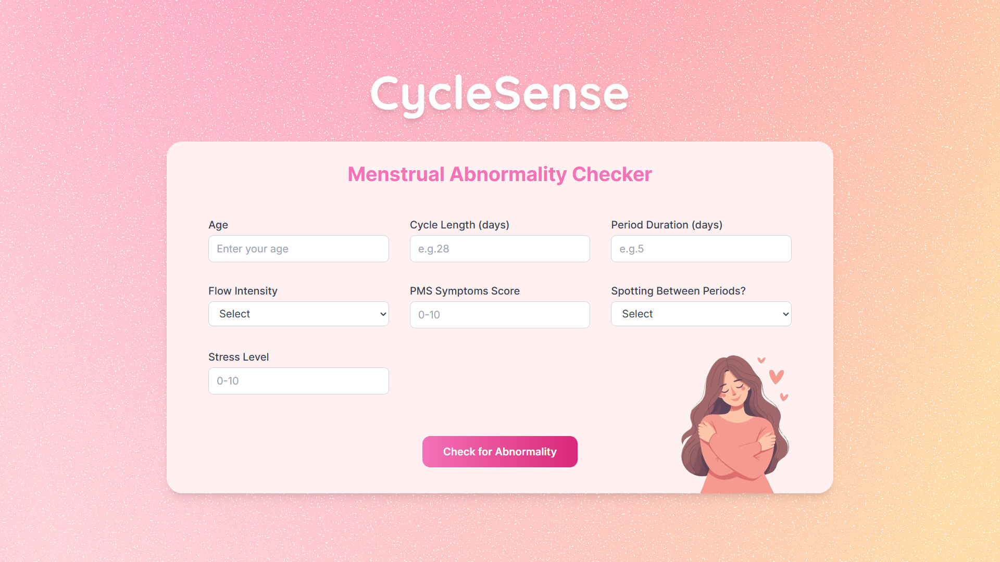
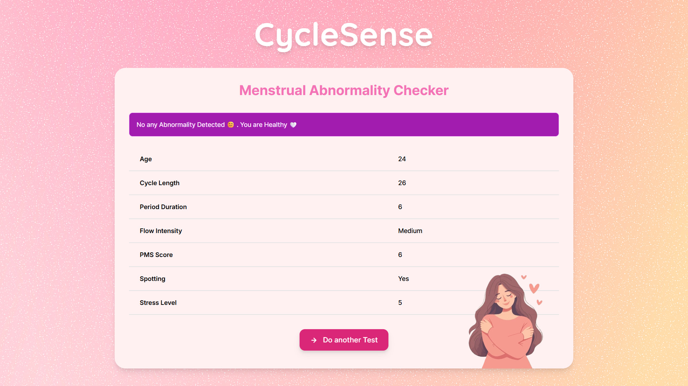
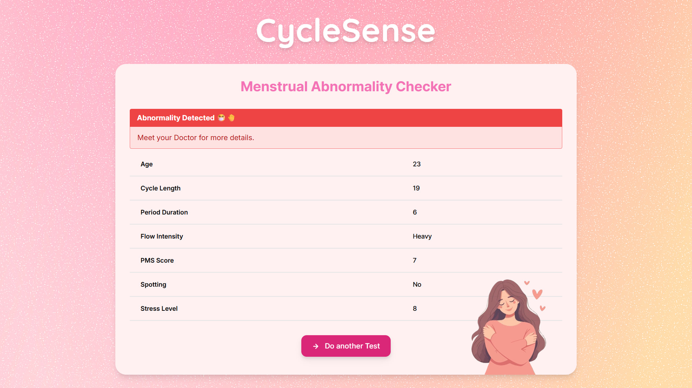

 
# 🌸 CycleSense - Menstrual Abnormality Checker

**CycleSense** is a machine learning-based web application that detects menstrual abnormalities using user inputs. It is powered by a trained **Random Forest** model and built with a **Flask** backend.

<div align="center">
  
</div>


---

## 🚀 Features

- Predicts menstrual cycle abnormality
- Clean, responsive user interface
- Built using Flask for backend and HTML/CSS for frontend
- Uses a trained Random Forest model
- Easy to set up and run locally

---

## 🧠 Machine Learning

- **Algorithm Used**: Random Forest Classifier
- **Training Files**: Located in `ml_model_dataset/` and `ml_model_notebooks/`
- **Trained Model**: Stored in `ml_model/`
- **Features Used**:
  - Age
  - Average Cycle Length
  - Period Duration
  - Flow Intensity
  - PMS Symptoms Severity
  - Spotting Between Periods
  - Stress Level
- **Target**: Normal / Abnormal

---

## 🌐 Live Application

Try it online: [CycleSense Web App](https://prasadnirmal2021.eu.pythonanywhere.com/)

---

## 🛠️ Getting Started Locally

### 📁 Clone the Repository

```bash
git clone https:
cd cyclesense
```

### 📦 Set Up Environment

It’s recommended to use a virtual environment:

```bash
python -m venv environment
source environment/bin/activate  # On Windows: environment\Scripts\activate
```

### 📥 Install Requirements

```bash
pip install -r requirements.txt
```

### 🚀 Run the App

```bash
python main.py
```

Now, go to `http://127.0.0.1:5000` in your browser.

---

## 📂 Folder Structure

```
cyclesense/
│
├── environment/              # Virtual environment (excluded from Git)
├── ml_model/                 # Contains trained model (.pkl)
├── ml_model_dataset/         # Dataset used for training
├── ml_model_notebooks/       # Jupyter notebooks for training & EDA
├── static/                   # CSS, images, icons
├── templates/                # HTML files (UI templates)
├── .gitignore                # Git ignored files list
├── main.py                   # Main Flask application
├── README.md                 # Project documentation
└── requirements.txt          # Python dependencies
```

---

## 🤝 Contributing

We welcome contributions to improve CycleSense. If you'd like to help:

- Fork the repository
- Create a new branch
- Make your changes
- Submit a Pull Request

---

## 📄 License

This project is licensed under the MIT License. See the [LICENSE](LICENSE) file for more information.

---

## 📷 Screenshot

<div align="center">
  
</div>
<br>
<div align="center">
  
</div>

---
